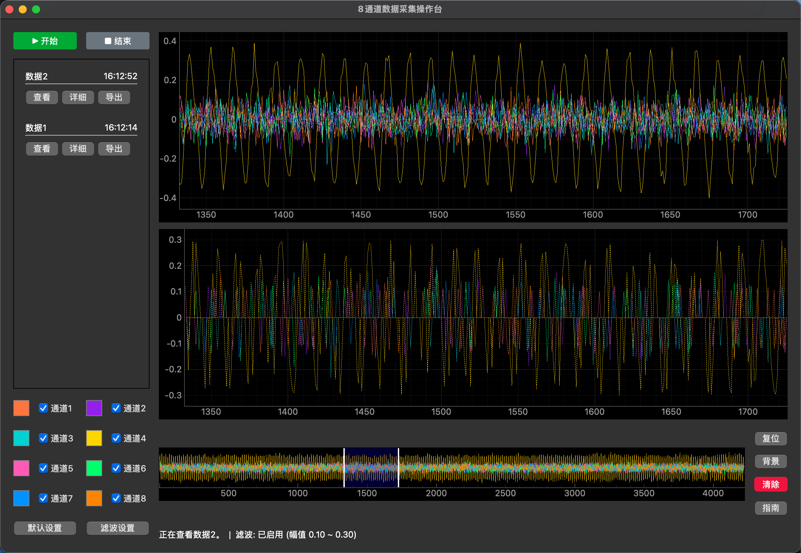
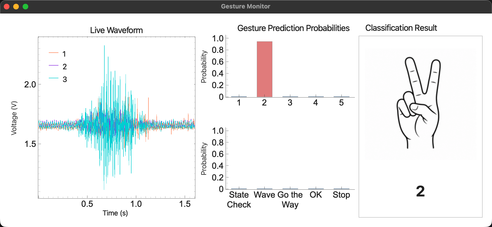
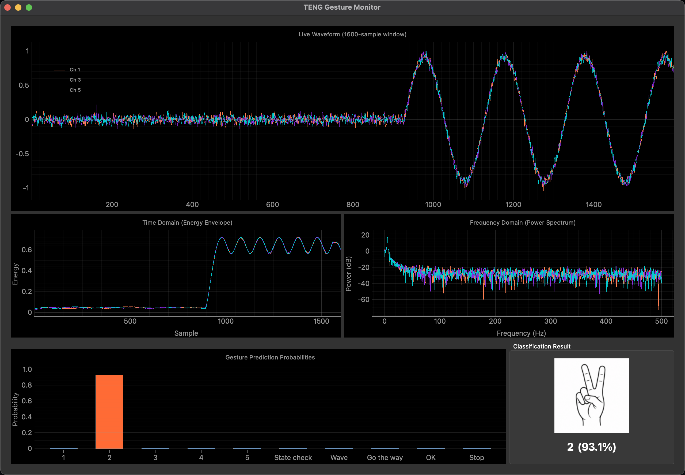

<p align="center">
  
</p>

<h1 align="center">WaveDAQ License System</h1>
<p align="center">Licensing, distribution, and offline verification for desktop software</p>
<p align="center"><a href="README.md">中文</a> | <strong>English</strong></p>
<p align="center"><a href="https://github.com/LMDHQ-0420/WaveDAQ-License-System/releases">Download</a> · <a href="#technical-report">Technical Report</a></p>

<p align="center">
  
  
  
  
</p>

## Supported Software

| Image | Software | Description |
|---|---|---|
|  | [**WaveDAQ**](https://github.com/LMDHQ-0420/WaveDAQ) | WaveDAQ is a desktop data-acquisition and waveform-analysis application for experimental work, supporting 8-channel UDP real-time data reception, data acquisition, online filtering, channel selection, and flexible control of waveform display styles, display ranges, and interface layout for real-time observation and processing of multi-channel experimental data. For security reasons, WaveDAQ is not open source; please contact [sunyuxiang25@mails.ucas.edu.cn](mailto:sunyuxiang25@mails.ucas.edu.cn) if needed. |
|  | [**MTFGesture 1.0**](https://github.com/LMDHQ-0420/MTFGesture1.0) | MTFGesture 1.0 is a real-time deep-learning gesture-recognition system based on multi-channel sensor signals, combining a lightweight desktop monitor with the MTF-GestureNet multi-scale time-frequency gesture network. It performs real-time deep-learning inference and visualization at 10 Hz, showing three-channel waveforms, Softmax probabilities for 10 classes, and the predicted result, achieving **96.76%** test accuracy and a **0.9663** test macro F1 score on 10 gesture classes; at deployment, a 5-second silent calibration establishes the noise baseline and DC offset, after which five samples for each class can be collected to fine-tune the classification head with the current sensor and user, or fine-tuning can be skipped to use the pretrained base model. |
|  | [**MTFGesture 2.0**](https://github.com/LMDHQ-0420/MTFGesture2.0) | MTFGesture 2.0 belongs to the same multi-scale time-frequency gesture-recognition system as MTFGesture 1.0 and supports real-time deep-learning computation, gesture recognition, and desktop visualization from multi-channel sensor signals, achieving **96.76%** test accuracy and a **0.9663** test macro F1 score on 10 gesture classes while supporting deployment-time model fine-tuning through silent calibration and prompted gesture capture; in addition to real-time three-channel waveforms, class probabilities, and classification results, version 2.0 also provides visualization of model input features to make the input signals and model-analysis process easier to inspect. |

> For customization requests, please contact [sunyuxiang25@mails.ucas.edu.cn](mailto:sunyuxiang25@mails.ucas.edu.cn)

## User Guide

### 1. Download the verification software

Download the appropriate WaveDAQ-Launcher package from [GitHub Releases](https://github.com/LMDHQ-0420/WaveDAQ-License-System/releases). On macOS, download the DMG for your architecture; on Windows, download the installer ending in `-setup.exe`.

### 2. Get an activation code

Activation codes are created and distributed by the administrator. To request a code, check an authorized product, or handle device binding, contact:

**sunyuxiang25@mails.ucas.edu.cn**

### 3. Activate and use a product

1. Launch WaveDAQ-Launcher.
2. Enter the activation code and submit the device authorization request.
3. After activation, the Launcher displays the authorized products.
4. Select a product and install or launch it.
5. The Launcher matches the GitHub Release asset for the current platform and verifies its SHA-256 digest.
6. Launch the installed product from the Launcher.

The first activation requires an Internet connection. After activation, the signed license is stored locally and the product can start offline. When online again, the Launcher can synchronize the license state and product information.

One activation code can be bound to one device. Contact the administrator to unbind the old device before moving to another computer. License terms support permanent authorization and custom expiration dates.

### 4. Install from source

Python 3.11, Conda, and a network connection are required:

```
git clone https://github.com/LMDHQ-0420/WaveDAQ-License-System.git
cd WaveDAQ-License-System
conda create -n WaveDAQLaucher python=3.11 -y
conda activate WaveDAQLaucher
pip install -r launcher/requirements.txt
python launcher/src/main.py
```

Source execution uses the Worker URL and server public key in `launcher/src/config.py` and is intended for development and testing.

### 5. Frequently asked questions

#### 1. Where can I get an activation code?

Contact sunyuxiang25@mails.ucas.edu.cn and provide the product and operating system you need.

#### 2. Why is an Internet connection required for activation?

The server checks the activation code, authorized products, expiration, and device binding before issuing a signed license. Internet access is not required every time the product starts after the first activation.

#### 3. Can one activation code be used on two computers?

No. One activation code can be bound to only one device. Contact the administrator to unbind it before moving to another computer.

#### 4. Can the product be used offline?

Yes. After the first activation, the Launcher and product verify the signed license locally. A custom expiration date is still enforced offline.

#### 5. Why is a product missing?

The product must be registered by the administrator and included in the current activation code.

#### 6. What are the Launcher and the product?

The Launcher is the unified authorization, installation, and launch entry point. The product is the desktop application that provides the actual functions. One Launcher can manage multiple products.

#### 7. How do I report a problem?

Send the operating system, Launcher message, product name, and reproduction steps to sunyuxiang25@mails.ucas.edu.cn. Do not submit device private keys, administrator passwords, or GitHub Tokens.

## Technical Report

### 1. Data flow

```
Data Flow/
├── Administrator Console
│   ├── Product name, product ID, and GitHub repository
│   │   └── Write → Cloudflare D1
│   └── Activation code, license term, and authorized products
│       └── Write → Cloudflare D1
├── User launches Launcher
│   ├── Activation code, device ID, and device public key
│   │   └── Request → Cloudflare Worker
│   │       └── Check license and device binding → Cloudflare D1
│   │           └── Return Ed25519-signed license → Launcher
│   └── Save license and device information
│       └── Write → Local WaveDAQ-Launcher data directory
├── Launcher checks products
│   └── Request latest Release → Cloudflare Worker
│       └── Read latest Release → Product GitHub repository
│           └── Return platform asset, version, and SHA-256 → Launcher
├── Launcher downloads a product
│   └── Download request → Cloudflare Worker
│       └── Read and verify latest GitHub asset again → GitHub
│           └── Proxy package → Launcher
│               └── Verify SHA-256, save, install, and launch → Local product
└── Product starts
    ├── Read local license and device key → Local data directory
    └── Verify signature, product ID, platform, and term offline → Product startup
```

The three parts are the WaveDAQ-Launcher, independent product repositories, and the Cloudflare authorization service. Release versions belong to GitHub Releases and are not part of license configuration. The Worker reads the latest Release and matches `macos-arm64`, `macos-x64`, or `windows-x64` assets.

### 2. Project structure

```
WaveDAQ-License-System/
├── .github/workflows/build-launcher.yml # Launcher release workflow
├── launcher/                            # WaveDAQ-Launcher
│   ├── src/main.py                      # GUI entry point
│   ├── src/gui.py                       # Activation, product, download, and launch UI
│   ├── src/api_client.py                # API requests
│   ├── src/config.py                    # Worker URL and public key
│   ├── src/device_identity.py           # Device Ed25519 key and encrypted local storage
│   ├── src/license_verifier.py          # Launcher license verification
│   ├── src/local_storage.py             # License, catalog, and installation records
│   ├── src/release_downloader.py        # Download and SHA-256 verification
│   ├── src/software_installer.py        # Installer opening and product launch
│   ├── tests/                           # Launcher tests
│   ├── installer/WaveDAQ-Launcher.iss  # Windows installer configuration
│   └── Launcher.spec                    # PyInstaller configuration
├── assets/                              # Release icons and project images
│   ├── app.icns                          # macOS application icon
│   ├── app.ico                           # Windows application icon
│   ├── WaveDAG.png                       # WaveDAQ interface image
│   ├── MTFGesture1.0.png                 # MTFGesture 1.0 interface image
│   ├── MTFGesture2.0.png                 # MTFGesture 2.0 interface image
│   └── logo.png                           # License system logo
├── license_sdk/                         # Offline verification module for products
│   ├── __init__.py
│   ├── config.py                        # Product ID and server public key
│   ├── local_crypto.py                  # Machine-bound local encryption
│   ├── license_dialog.py                 # Shared Qt authorization dialog
│   └── verifier.py                      # Signature, device, term, and platform checks
├── cloudflare/
│   ├── package.json                     # Cloudflare project scripts
│   ├── worker/                          # Worker API and D1 migrations
│   ├── admin/                           # React administrator console
│   ├── shared/license-schema.json       # Offline license document schema
│   └── tools/                           # Key, activation code, and password tools
├── .gitignore
└── README.md
```

Products such as WaveDAQ are maintained in independent repositories. A product only needs to copy `license_sdk`.

### 3. D1 database structure

| Table | Purpose | Main fields |
|---|---|---|
| products | Product catalog | `id`, `name`, `description`, `github_repository`, `status`, `is_frozen`, `created_at` |
| licenses | Activation codes and license state | `id`, `name`, `code_hash`, `code_ciphertext`, `status`, `term`, `expires_at`, `is_frozen`, `created_at` |
| license_products | License-to-product relationship | `license_id`, `product_id` |
| devices | Device identity | `id`, `public_key`, `fingerprint`, `status`, `created_at`, `last_seen_at` |
| activations | Activation-to-device binding | `license_id`, `device_id`, `activated_at` |
| request_nonces | Request replay protection | `nonce`, `device_id`, `created_at` |
| admin_login_attempts | Administrator login rate limiting | `client_hash`, `failures`, `first_failed_at`, `last_failed_at`, `blocked_until` |

Product versions, platform assets, and SHA-256 digests are resolved directly from the latest GitHub Release at request time and are not stored in D1.

### 4. Public API

Device requests use these headers:

```
x-device-id
x-device-timestamp
x-device-nonce
x-device-signature
```

The signed message is:

```
{HTTP_METHOD}\\n{PATH}\\n{license_id}\\n{device_id}\\n{timestamp}\\n{nonce}
```

| Method | Path | Purpose |
|---|---|---|
| POST | `/api/activate` | Activate one device with an activation code |
| GET | `/api/releases?license_id=lic_xxx` | Get authorized products and the latest platform assets |
| POST | `/api/license/refresh?license_id=lic_xxx` | Refresh the signed license |
| GET | `/api/download/{release_id}?license_id=lic_xxx&product_id=product_xxx&platform=macos-arm64` | Verify and proxy the latest package |
| POST | `/api/admin/login` | Administrator login |
| POST/GET/PATCH/DELETE | `/api/admin/...` | Product, license, and device management |

Administrator endpoints use the HttpOnly session cookie returned by `/api/admin/login`. They include product creation and editing, activation-code creation and viewing, license-term editing, revoke/freeze operations, and device unbinding.

### 5. Configure your own Cloudflare service

```bash
cd cloudflare/worker
npm install
npx wrangler login
npx wrangler d1 create your-license-database
```

Put the database ID, database name, and Worker name in `cloudflare/worker/wrangler.toml`. Then configure the Secrets:

```bash
python ../tools/generate_signing_key.py
npx wrangler secret put LICENSE_SIGNING_PRIVATE_KEY
python ../tools/set_admin_password.py
npx wrangler secret put ADMIN_PASSWORD_HASH
openssl rand -hex 32
npx wrangler secret put ADMIN_TOKEN
npx wrangler secret put GITHUB_TOKEN
```

Keep the signing private key, administrator password hash, administrator token, and GitHub Token in Cloudflare Secrets only. Put the signing public key in `launcher/src/config.py` and each product's `license_sdk/config.py`.

Build the administrator console, apply migrations, and deploy:

```bash
cd cloudflare/admin
npm install
npm run build
cd ../worker
npx wrangler d1 migrations apply your-license-database --remote
npx wrangler deploy
```

Put the deployed Worker URL in `launcher/src/config.py` as `API_URL`, then rebuild the Launcher and products. Local development uses `cloudflare/worker/.dev.vars` and `npx wrangler dev`.

### 6. Runtime directories

The Launcher and products share the `WaveDAQ-Launcher` user data directory:

```
macOS:  ~/Library/Application Support/WaveDAQ-Launcher/
Windows: %APPDATA%\\WaveDAQ-Launcher\\
Linux:   ~/.config/WaveDAQ-Launcher/
```

The directory contains `device.json`, `license.json`, `licenses/`, `catalogs/`, `installations.json`, `downloads/`, and `revoked_licenses.json`. Packages are stored at `<data directory>/WaveDAQ-Launcher/downloads/<product_id>/<version>/<file_name>`.

Device private keys, license files, and anti-clock-rollback data do not use macOS Keychain, Windows Credential Manager, or Linux Secret Service. They are encrypted with a key derived from the local machine code and stored in the application data directory. The Launcher checks the machine code before startup; after activation, normal startup and license verification are offline by default.

### 7. Add the verification module to another product

Copy the root `license_sdk/` directory into the product and set its configuration:

```python
PRODUCT_ID = "your-product-id"
SERVER_PUBLIC_KEY = "your-server-public-key"
```

Call `require_valid_license()` from the real product entry point before starting the application. The product ID must exactly match the ID registered in the administrator console. Products do not configure a version number, data directory name, or keychain service name.

### 8. Configure GitHub packaging for a new product

A new product should maintain its source code and packaging workflow in its own GitHub repository; it does not need to copy the entire WaveDAQ-License-System. First create the product in the administrator console with a unique product ID, product name, and GitHub repository URL. Then copy `license_sdk/` into the product project, configure the product ID and server public key, and call the local license check from the real product entry point. The product repository should contain `.github/workflows/build.yaml`, use GitHub Actions to build separate packages on macOS Apple Silicon, macOS Intel, and Windows x64, and upload the results to a GitHub Release. Release tags use a `v`-prefixed version such as `v1.0.0` or `v1.1.0`; the Launcher reads the latest Release, so versions do not need to be stored in D1.

The Worker identifies platform assets from their file names, so each name must contain `macos-arm64`, `macos-x64`, or `windows-x64`. macOS products use DMG packages, while Windows products use directly launchable EXE files; the Launcher stores downloaded products in its own data directory and starts them without a traditional installer. After assets are uploaded, GitHub provides a SHA-256 digest automatically. The Worker reads that digest, and the Launcher computes SHA-256 again after downloading before saving or launching the product. The complete example below can be placed at `.github/workflows/build.yaml` in a new product repository. It assumes that the product entry point is `app/main.py`, dependencies are listed in `requirements.txt`, and icons are located at `assets/app.icns` and `assets/app.ico`; change these paths and `APP_NAME` for the actual project.

```yaml
name: Build and Release Product

on:
  push:
    tags:
      - "v*"

permissions:
  contents: write

env:
  APP_NAME: MTFGesture

jobs:
  build-macos:
    name: Build macOS ${{ matrix.arch }}
    runs-on: ${{ matrix.runner }}
    strategy:
      fail-fast: false
      matrix:
        include:
          - arch: arm64
            runner: macos-14
          - arch: x64
            runner: macos-13

    steps:
      - name: Check out source
        uses: actions/checkout@v4

      - name: Set up Python
        uses: actions/setup-python@v5
        with:
          python-version: "3.11"

      - name: Install dependencies
        run: |
          python -m pip install --upgrade pip
          python -m pip install -r requirements.txt
          python -m pip install pyinstaller

      - name: Build macOS application
        run: |
          python -m PyInstaller \
            --noconfirm \
            --clean \
            --windowed \
            --name "${APP_NAME}" \
            --icon assets/app.icns \
            app/main.py

      - name: Install create-dmg
        run: brew install create-dmg

      - name: Create macOS DMG
        run: |
          create-dmg \
            --volname "${APP_NAME}" \
            --window-pos 200 120 \
            --window-size 600 400 \
            --icon-size 100 \
            --icon "${APP_NAME}.app" 175 190 \
            --hide-extension "${APP_NAME}.app" \
            --app-drop-link 425 190 \
            "${APP_NAME}-macos-${{ matrix.arch }}-${GITHUB_REF_NAME}.dmg" \
            "dist/${APP_NAME}.app"

      - name: Upload macOS package
        uses: actions/upload-artifact@v4
        with:
          name: product-macos-${{ matrix.arch }}
          path: "${{ env.APP_NAME }}-macos-${{ matrix.arch }}-${{ github.ref_name }}.dmg"
          if-no-files-found: error

  build-windows:
    name: Build Windows x64
    runs-on: windows-latest

    steps:
      - name: Check out source
        uses: actions/checkout@v4

      - name: Set up Python
        uses: actions/setup-python@v5
        with:
          python-version: "3.11"

      - name: Install dependencies
        shell: pwsh
        run: |
          python -m pip install --upgrade pip
          python -m pip install -r requirements.txt
          python -m pip install pyinstaller

      - name: Build Windows executable
        shell: pwsh
        run: |
          python -m PyInstaller `
            --noconfirm `
            --clean `
            --onefile `
            --windowed `
            --name "${env:APP_NAME}" `
            --icon assets/app.ico `
            app/main.py
          Copy-Item "dist/${env:APP_NAME}.exe" "${env:APP_NAME}-windows-x64-${env:GITHUB_REF_NAME}.exe"

      - name: Upload Windows package
        uses: actions/upload-artifact@v4
        with:
          name: product-windows-x64
          path: "${{ env.APP_NAME }}-windows-x64-${{ github.ref_name }}.exe"
          if-no-files-found: error

  publish-release:
    name: Publish GitHub Release
    needs: [build-macos, build-windows]
    runs-on: ubuntu-latest

    steps:
      - name: Download build artifacts
        uses: actions/download-artifact@v4
        with:
          path: release-assets
          merge-multiple: true

      - name: Publish release
        uses: softprops/action-gh-release@v2
        with:
          name: "${{ env.APP_NAME }} ${{ github.ref_name }}"
          draft: false
          prerelease: false
          fail_on_unmatched_files: true
          files: release-assets/*
```

Before publishing, confirm that the three assets are named similar to `XX-macos-arm64-v1.0.0.dmg`, `XX-macos-x64-v1.0.0.dmg`, and `XX-windows-x64-v1.0.0.exe`, and confirm that GitHub Actions has `contents: write` permission. After the Release is published, register the repository as a product in the administrator console. The Launcher will read the latest Release, match the current platform, verify SHA-256, and download the product automatically.
