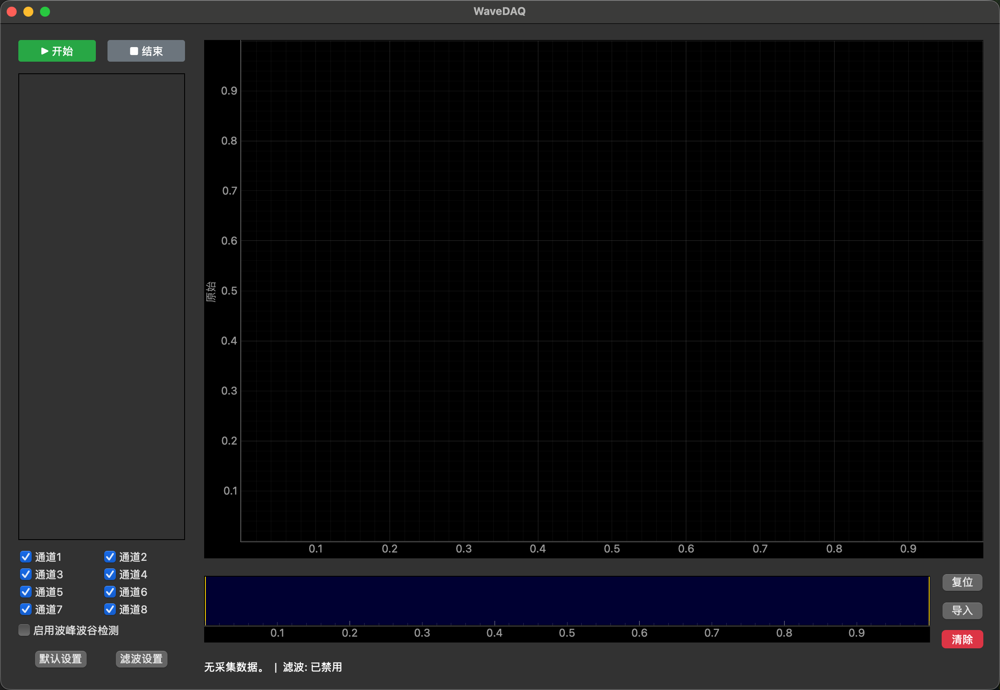
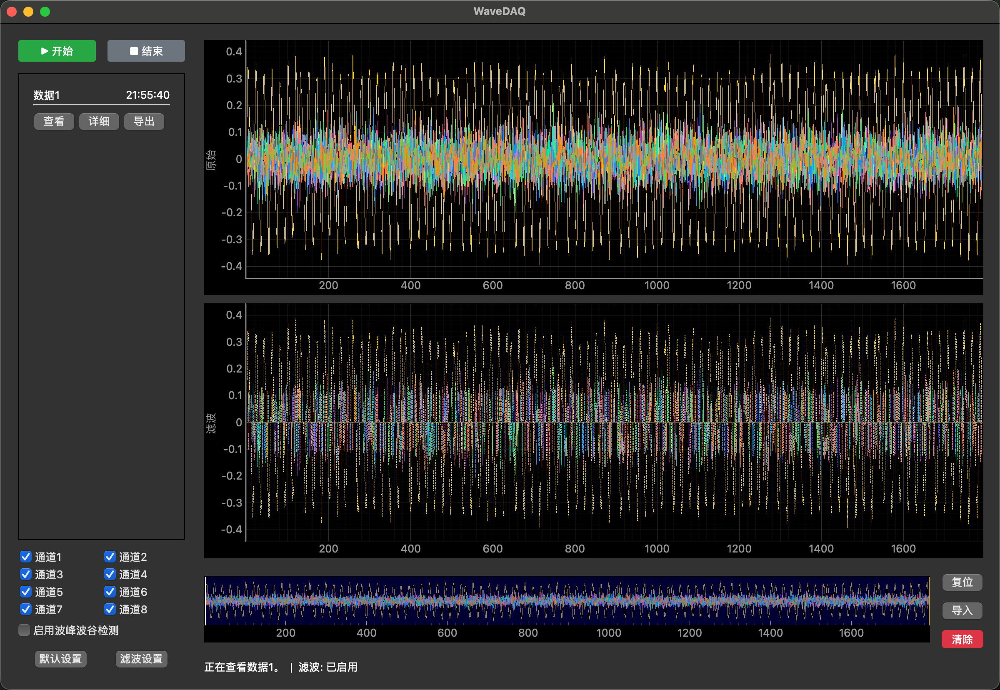
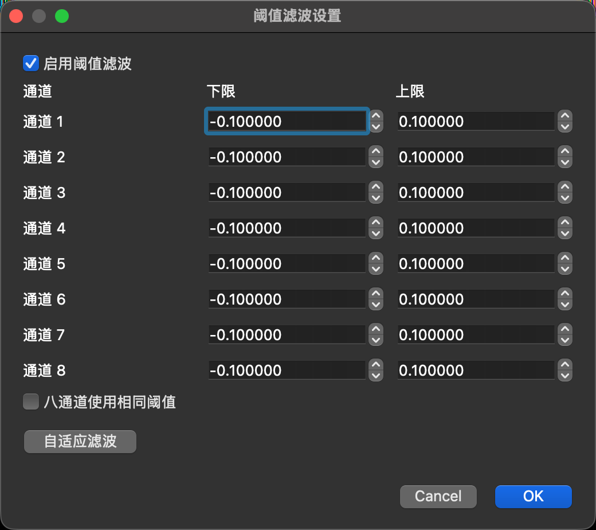
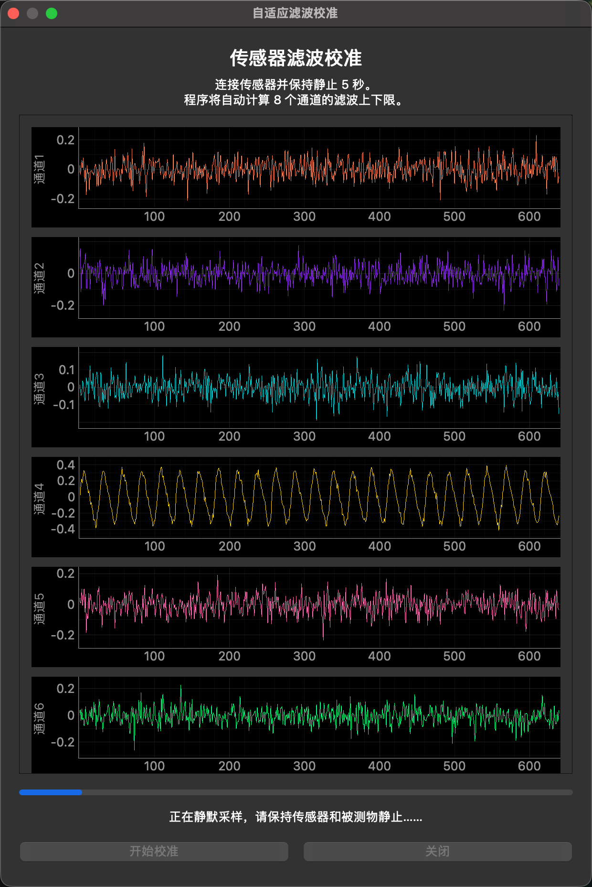
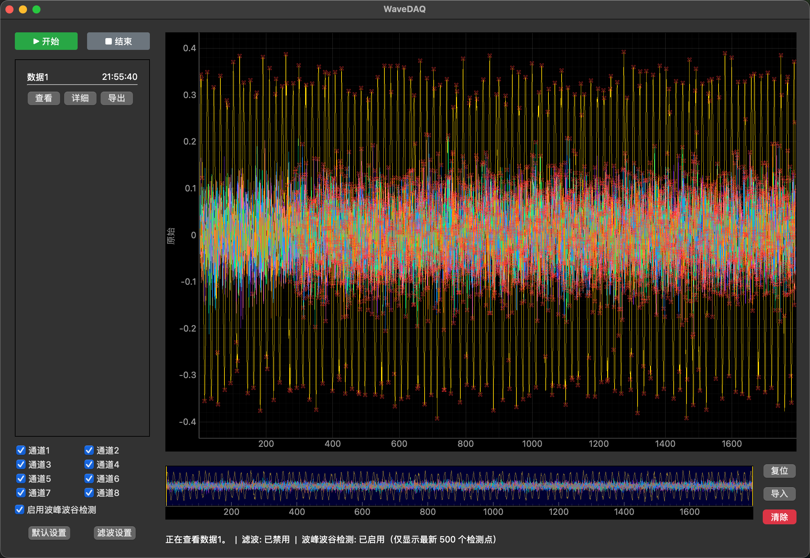
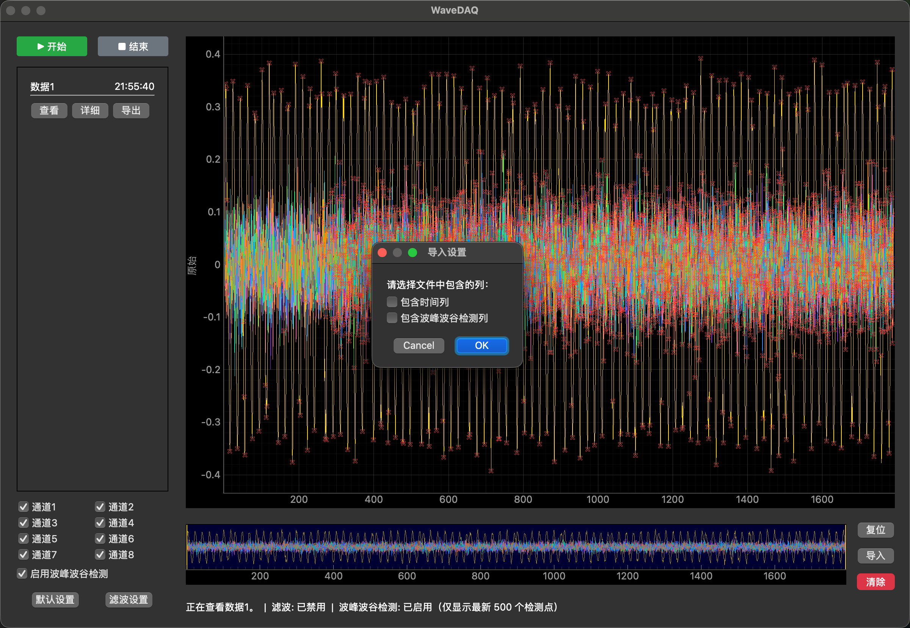
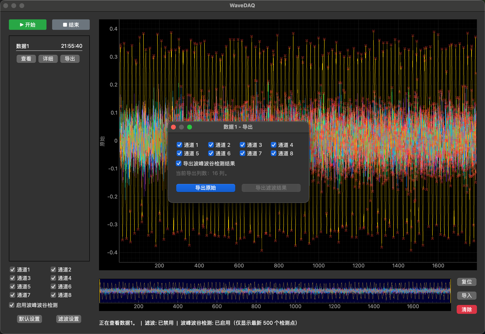
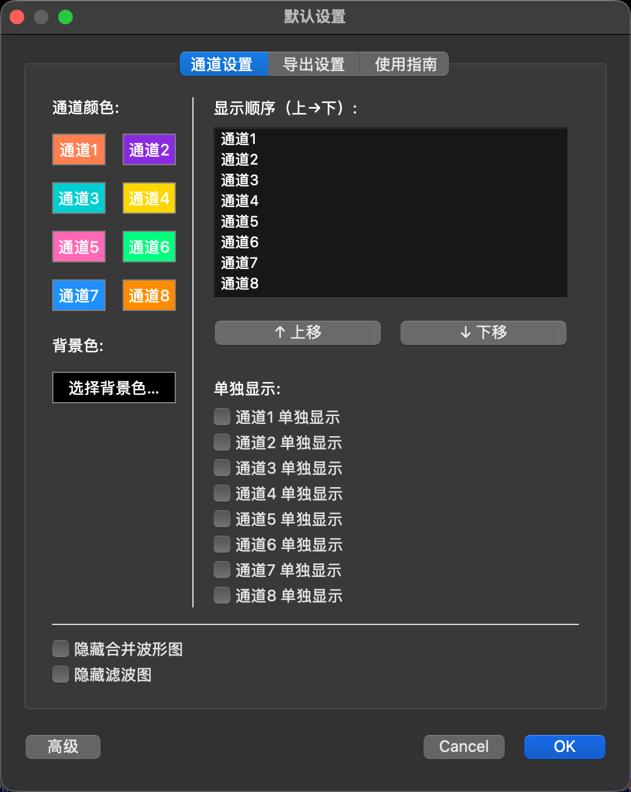

# WaveDAQ 功能与使用说明

WaveDAQ 是一款面向多通道传感器实验的桌面数据采集与波形分析软件，支持 8 通道 UDP 数据接收、实时波形显示、记录管理、阈值滤波、波峰波谷检测、CSV 导入导出以及显示界面自定义。本说明介绍 WaveDAQ 的主要功能、运行方式、典型操作流程和数据文件格式。

## 一、软件界面概览

<p align="center"></p>

WaveDAQ 启动后显示主窗口。窗口标题为“WaveDAQ”，左侧是采集控制、通道选择和设置区域，右侧是原始波形图、滤波波形图和底部概览图。程序主界面最多保存 20 条当前运行记录，记录保存在内存中，关闭程序后不会自动恢复。

主界面主要分为以下区域：

| 区域 | 功能 |
|---|---|
| 开始、结束 | 开始或停止一次数据采集 |
| 记录列表 | 查看、查看详细信息、重新采集、导出已有记录 |
| 通道 1～通道 8 | 控制对应通道是否显示 |
| 启用波峰波谷检测 | 开启或关闭实时波峰、波谷识别和红色标记 |
| 默认设置 | 配置导出、通道显示、界面外观和使用指南 |
| 滤波设置 | 配置 8 个通道的噪声阈值和自适应滤波 |
| 复位 | 恢复主图自动跟随和默认视图范围 |
| 导入 | 从 CSV 文件创建一条本地记录 |
| 清除 | 删除当前运行中的全部记录 |
| 原始波形图 | 显示 8 个通道的原始数据 |
| 滤波波形图 | 在启用滤波后显示阈值处理结果 |
| 概览图 | 显示完整数据范围并通过黄色范围框定位主图 |

## 二、基础采集流程

### 1. 开始采集

1. 确认传感器或 UDP 数据发送程序已经启动。
2. 打开 WaveDAQ，观察主图是否能够接收到波形。
3. 在左侧选择需要显示的通道。
4. 根据需要打开“启用波峰波谷检测”。
5. 点击“▶ 开始”。
6. 采集过程中，状态栏会显示当前正在采集的记录编号。

采集开始后，UDP 接收线程持续接收数据，数据先进入实时缓冲区，再由主界面定时刷新到波形图。原始采集数据不会因为主图下采样而丢失。

### 2. 结束采集

点击“■ 结束”后，WaveDAQ 会将当前缓冲区中的数据合并为一条记录，并加入左侧记录列表。记录默认命名为“数据1”“数据2”等，并显示采集开始时间。

程序最多保存 20 条当前运行记录。达到上限后，需要清除旧记录，或者通过“重采”覆盖已有记录。

### 3. 查看记录

每条记录提供三个操作：

- “查看”：在主图中回放该记录。
- “详细”：查看开始时间、结束时间、采样总时间和断面数。
- “导出”：选择通道并导出 CSV 文件。

回放记录时，主图可以拖动、缩放和使用底部概览图定位。点击“复位”或双击主图，可以恢复自动视图。

### 4. 重新采集

点击记录的“详细”，再点击“重采”，可以重新采集并覆盖该记录。重新采集前程序会要求确认。覆盖后的记录名称保持不变，但数据、时间和检测状态会更新。

## 三、波形显示和视图操作

<p align="center"></p>

### 1. 原始波形图

原始波形图同时显示 8 个通道，每个通道使用独立颜色。通道复选框只控制显示，不会删除数据，也不会影响导出内容。

主图最多使用约 2000 个绘图点进行显示。当数据量较大时，程序会根据当前视图范围进行下采样，以减少绘图开销；记录本身仍然保留完整采样点。

### 2. 概览图和范围框

底部概览图显示当前记录的整体范围。黄色范围框表示主图当前显示的区间：

- 拖动黄色范围框：快速移动主图显示位置；
- 拖动范围框左右边缘：调整显示区间；
- 拖动主图：平移当前视图；
- 双击主图或点击“复位”：恢复自动视图。

### 3. 通道单独显示

在“默认设置 → 通道设置”中，可以为通道启用“单独显示”。启用后，程序会在主显示区域增加对应通道的独立波形图，并与主图的时间范围联动。

## 四、阈值滤波

<p align="center"></p>

### 1. 滤波功能

点击左下角“滤波设置”打开滤波配置窗口。勾选“启用阈值滤波”并确认后，右侧会显示滤波波形图。

滤波不会修改原始记录，只会在滤波图和“导出滤波结果”中生成处理后的数据。

每个通道都有独立的有符号下限和上限。当前滤波逻辑将上下限之间的区间视为静态噪声区间：

```text
下限 ≤ 数据 ≤ 上限：置零
数据 < 下限或数据 > 上限：保留
```

因此，阈值可以是负数，也可以跨越零点。例如，设置为 `-0.1` 和 `0.1`，表示将 `-0.1～0.1` 范围内的低幅噪声置零，同时保留范围外的信号。

### 2. 八通道使用相同阈值

勾选“八通道使用相同阈值”后，8 个通道的下限输入框会同步，8 个通道的上限输入框也会同步。启用该选项时，程序使用当前 8 个输入框中同类数值的最大值，覆盖全部通道。

取消勾选后，可以重新为每个通道设置独立的上下限。

### 3. 自适应滤波

<p align="center"></p>

自适应滤波用于根据传感器当前的静态噪声自动计算阈值。它不会自动修改原始数据，只会生成一组建议的上下限。

使用步骤：

1. 先结束当前采集。
2. 打开“滤波设置”。
3. 点击窗口底部的小按钮“自适应滤波”。
4. 连接传感器，并保持传感器和被测物静止。
5. 点击“开始校准”。
6. 连续静默采样 5 秒。
7. 校准完成后，8 个通道的上下限会自动回填。
8. 程序会自动勾选阈值滤波，但不会自动确认外层窗口。
9. 检查参数后点击“确定”应用。

自适应算法对每个通道独立处理：

```text
中心值 = 静默数据的中位数
MAD = median(|数据 - 中心值|)
鲁棒标准差 = 1.4826 × MAD
噪声范围 = max(99% 偏差分位数, 5 × 鲁棒标准差)
下限 = 中心值 - 噪声范围
上限 = 中心值 + 噪声范围
```

相比直接使用静默数据的最大值和最小值，该方法对低频漂移和偶发尖峰更不敏感。校准时必须保持静止，否则真实动作会被误认为静态噪声并扩大阈值范围。

## 五、波峰波谷检测

<p align="center"></p>

### 1. 开启和关闭

主界面左侧的“启用波峰波谷检测”是实时显示开关，可以在采集、停止和回放期间随时切换。

开启后，程序会在每个通道的波形上寻找局部极值：

- 波峰：标记值为 `1`，在图上显示红色细叉号；
- 波谷：标记值为 `-1`，在图上显示红色细叉号；
- 普通采样点：标记值为 `0`。

实时采集时，程序使用增量方式处理最新数据，只重新检查短时间重叠区域，不重复扫描全部历史数据。主图默认只显示最新 500 个检测点，可在“默认设置”窗口左下角的“高级”按钮中调整显示数量。该设置只影响主图显示，不影响完整数据和导出结果。

### 2. 回放和导出

回放记录时，如果主界面开启检测，程序会显示该记录的检测结果；关闭检测后，红色标记会隐藏。

在记录列表点击“导出”，可以勾选“导出波峰波谷检测结果”。勾选后程序会导出全部 8 个通道，每个通道占两列：

```text
通道1, 通道1标记, 通道2, 通道2标记, ... , 通道8, 通道8标记
```

此时文件共 16 列。如果在“默认设置 → 导出设置”中勾选“包含时间（ms）”，第一列会增加数字时间列，文件共 17 列：

```text
时间(ms), 通道1, 通道1标记, ... , 通道8, 通道8标记
```

## 六、数据导入

<p align="center"></p>

在底部概览图右侧，点击“复位”和“清除”之间的“导入”按钮，可以从 CSV 文件创建一条记录。导入的记录名称使用原始文件名，记录列表中的时间显示为“导入”，详细信息中的开始时间和结束时间显示为“-”。采样总时间和断面数会自动计算。

导入时程序会要求选择两个选项：

- “包含时间列”：表示 CSV 第一列是时间（ms）；
- “包含波峰波谷检测列”：表示每个通道都有对应的检测标记列。

文件必须是规则的数字 CSV，每一行列数一致。根据选项，支持以下四种格式：

| 文件类型 | 列数 | 列排列 |
|---|---:|---|
| 普通 8 通道 | 8 | 通道 1～通道 8 |
| 含时间列 | 9 | 时间、通道 1～通道 8 |
| 含检测列 | 16 | 通道 1、标记 1、通道 2、标记 2，直到通道 8 |
| 含时间和检测列 | 17 | 时间、通道 1、标记 1，直到通道 8、标记 8 |

检测列只能包含 `-1`、`0`、`1`。导入后，已有的检测结果会被保留；打开主界面的波峰波谷检测开关即可查看。

## 七、数据导出

<p align="center"></p>

在记录列表点击“导出”按钮，打开导出窗口。导出窗口可以选择通道，并提供两个操作：

- “导出原始”：导出原始采样数据；
- “导出滤波结果”：在阈值滤波已经启用时，导出经过噪声区间抑制的数据。

默认情况下，未勾选检测结果时，导出列数等于选中的通道数；如果勾选“包含时间（ms）”，会额外增加第一列时间列。

勾选“导出波峰波谷检测结果”后，程序会自动选择全部 8 个通道，并导出 16 列信号和检测结果。界面下方会显示当前导出列数：

```text
普通导出：选中通道数
普通导出 + 时间：选中通道数 + 1
检测结果导出：16 列
检测结果导出 + 时间：17 列
```

文件保存路径、默认文件名、日期后缀、时间后缀和时间列选项，可以在“默认设置 → 导出设置”中配置。导出格式为 CSV，适合使用 Excel、Origin、MATLAB、Python 等工具继续分析。

## 八、默认设置

<p align="center"></p>

点击左下角“默认设置”打开配置窗口。窗口包含三个标签页：

### 1. 通道设置

- 修改 8 个通道的显示颜色；
- 修改通道在界面中的显示顺序；
- 设置通道是否单独显示；
- 选择背景色；
- 隐藏合并波形图；
- 隐藏滤波波形图。

### 2. 导出设置

- 选择默认保存目录；
- 设置默认文件名；
- 追加采集日期；
- 追加采集时间；
- 设置是否默认包含时间（ms）列。

文件名支持 `{name}`、`{date}` 和 `{time}` 占位符。例如：

```text
{name}_{date}_{time}.csv
```

### 3. 使用指南

“使用指南”标签页提供软件内置操作说明，适合首次使用时快速查看。

### 4. 高级设置

默认设置窗口左下角的“高级”按钮用于设置主图显示的波峰波谷检测点数量。数量越大，主图显示的红色标记越多，可能增加绘图负担；导出的检测结果不受这个数量限制。

## 九、记录和文件生命周期

WaveDAQ 当前运行中的采集记录保存在内存中：

- 点击“结束”后记录加入当前记录列表；
- 点击“清除”会删除全部当前记录；
- 关闭程序后，当前记录不会自动恢复；
- 导入的数据只存在于当前运行实例中；
- 只有点击导出后，数据才会写入用户选择的 CSV 文件。

导出的 CSV 文件由用户指定路径保存，WaveDAQ 不会自动上传数据，也不会将采集内容发送到云端。通过 Launcher 启动时，授权文件和产品下载缓存由 Launcher 单独维护，WaveDAQ 的采集记录仍由 WaveDAQ 当前运行实例管理。

## 十、常见问题

### 1. 主图没有波形

请检查传感器或 UDP 数据源是否启动，目标地址是否为运行 WaveDAQ 的电脑，端口是否为 `8080`，并确认已经点击“开始”。如果使用测试数据，请运行 `test_udp_sender.py`。

### 2. 波形断断续续或数据量增长很慢

请检查 UDP 网络是否稳定、发送端是否持续发送完整数据帧。程序会主动丢弃格式错误或不完整的数据包。

### 3. 自适应滤波后真实信号也被削弱

重新进行 5 秒静默校准时，必须确保静默期间没有真实动作或冲击。也可以在滤波设置中手动扩大噪声区间，或检查是否误开启了“八通道使用相同阈值”。

### 4. 波峰波谷标记太多或显示卡顿

在默认设置窗口左下角打开“高级”，减少主图检测点显示数量。该设置只减少红色标记的显示数量，不会删除检测结果。

### 5. 导入文件失败

确认文件是纯数字 CSV、每行列数一致，并检查导入设置是否与文件列数匹配。普通 8 通道文件为 8 列；包含时间列时增加 1 列；包含检测列时为 16 列或 17 列。

### 6. 导出滤波结果按钮不可用

请先在“滤波设置”中勾选“启用阈值滤波”并确认。导出滤波结果不会修改原始记录。

### 7. 如何获得 WaveDAQ

WaveDAQ 通过 WaveDAQ-Launcher 进行授权、下载和启动。验证系统发行包位于 [GitHub Releases](https://github.com/LMDHQ-0420/WaveDAQ-License-System/releases)。如需授权或产品使用支持，请联系 [sunyuxiang25@mails.ucas.edu.cn](mailto:sunyuxiang25@mails.ucas.edu.cn)。

Coding by [sunyuxiang25@mails.ucas.edu.cn](mailto:sunyuxiang25@mails.ucas.edu.cn)
